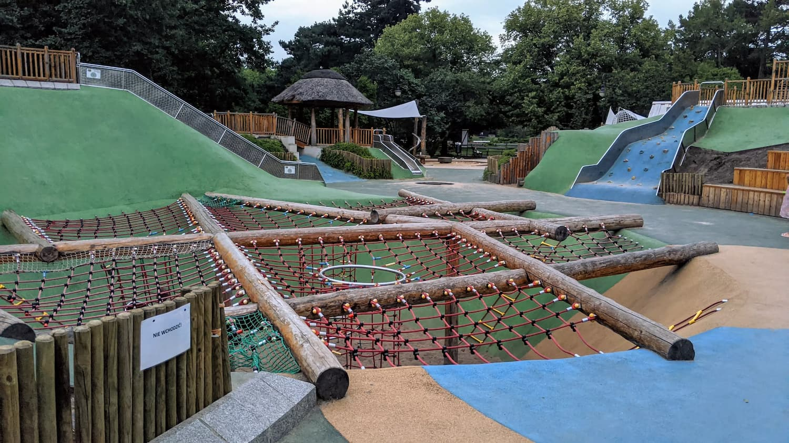
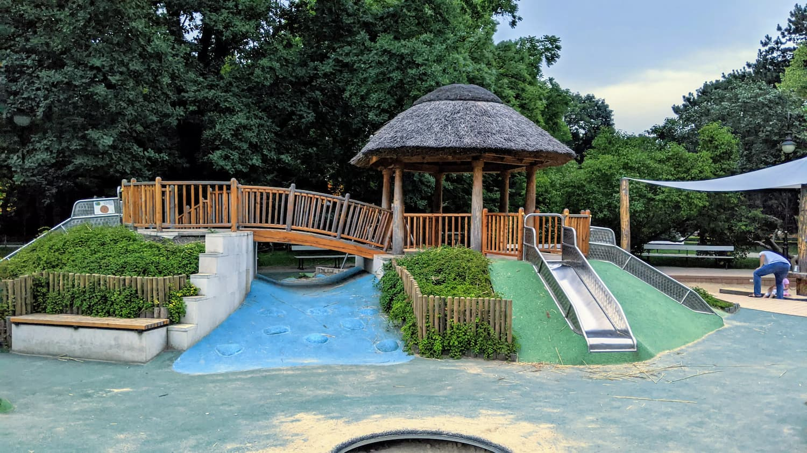
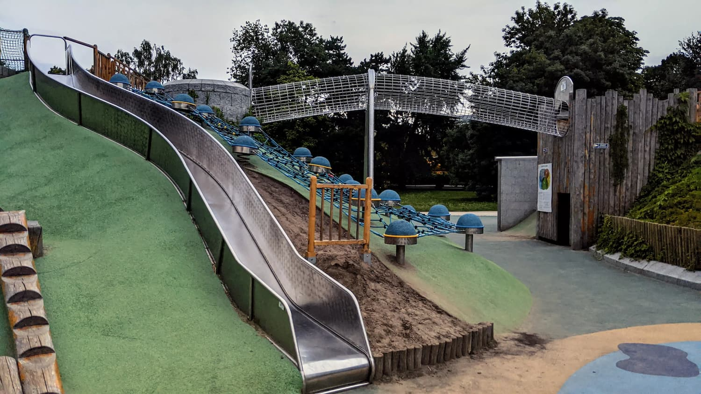

# Koncepcja architektoniczna placu zabaw — Park Sołacki

Draft warsztatowy. Modele i kwoty — orientacyjne, do weryfikacji u dystrybutorów (Richter Spielgeräte; KAISER&KÜHNE; Berliner Seilfabrik). Lokalizacja zalecana: północna lub północno-zachodnia polana parku, **min. 50–70 m od willi**, **min. 30 m od linii brzegowej stawów**, poza koronami starodrzewu. Ostateczny dobór po inwentaryzacji.

## Inspiracje wizualne (Park Ujazdowski, Warszawa)

Trzy zdjęcia referencyjne z placu w Parku Ujazdowskim (proj. Grima Architektura, urządzenia Richter Spielgeräte, otwarcie 2019). Pełne opisy architektoniczne — zob. [`../../research/pbo/img/park-ujazdowski/README.md`](../../research/pbo/img/park-ujazdowski/README.md).

| Zdjęcie | Element do replikacji w Sołaczu |
|---|---|
|  | **Landform playground** — kopce z zielonym EPDM zamiast pionowych wież; nie konkurują z osią widokową od ul. Mazowieckiej, wpisują się w typologię parku angielskiego Kubego |
|  | **Altana z robinii** + **most łukowy** wpisany w naturalne wyniesienie terenu — Sołacz ma skarpy nad stawami, można wykorzystać istniejące zamiast budować sztuczne |
|  | **Hill slide** wbudowany w wał ziemny + **pole grzybków sensorycznych** rozproszone (3–6 lat) — niska sylweta, brak konkurencji z drzewostanem |

**Trzy paradygmaty z Ujazdowskiego do przeniesienia:** (1) modelowanie terenu zamiast wież, (2) materialność „Naturholz" (robinia nieobrobiona, kora częściowo, łączniki stalowe ocynk, zero impregnacji), (3) brak pełnego ogrodzenia — palisada drewniana lub naturalne skarpy.

**Trzy pułapki, których unikać:** (1) niebieski EPDM imitujący wodę przy prawdziwych stawach Sołackich = kicz; (2) strzecha jako pokrycie altany — wernakularna, obca dla parku Kubego; (3) wieże >6 m blisko osi widokowej staw–willowa zabudowa.

## 1. Założenia projektowe

- **Adresat**: 3–6 (juniorska), 6–12 (główna), 12+ (młodzieżowa, swobodny upadek ≤3,0 m, PN-EN 1176-1).
- **Filozofia**: *natural play* (Spiegal, Nebelong) — minimum plastiku, drewno robinii (*Robinia pseudoacacia*) i dębu rdzennego, liny stalowo-konopne herkules Ø16–18 mm, integracja z mikrorzeźbą terenu, gradacja trudności.
- **Spójność z kompozycją Kube (1908–1912)**: krzywizny dopasowane do meandrującego układu alejek; zero geometrii ortogonalnej; max kalenica ok. 6,0 m (w linii koron); paleta ziemia–drewno–kamień–lina.
- **Zero otwartych luster wody** — bliskość stawów. Woda tylko z ręcznych pomp Archimedesa, kanaliki do piaskownicy, retencja w gruncie.

## 2. Strefowanie funkcjonalne („pokoje parkowe")

Siedem stref oddzielonych żywopłotami z grabu (*Carpinus betulus*) i wałami ziemnymi (tłumienie 3–5 dB / 2 m wału w paśmie 500–2000 Hz).

| Nr | Strefa | Wiek | Pow. (m²) |
|---|---|---|---|
| A | Brama, mała architektura | wszystkie | 150–200 |
| B | Juniorska 3–6 | 3–6 | 300–400 |
| C | Wieża wspinaczkowa + zjazd | 6–12, 12+ | 500–700 |
| D | Konstrukcja linowa wielkogabarytowa | 6–12, 12+ | 400–500 |
| E | Wodno-piaskowa (pompa + kanaliki) | 3–12 | 250–350 |
| F | Naturalna (kłody, głazy, mostki) | 3–12 | 300–400 |
| G | Integracyjna / sensoryczna | wszystkie | 200–300 |

Separacja od willi: 50 m + wał 1,5–2,0 m + 3-rzędowy żywopłot. Cel: LAeq <45 dB przy elewacji willi (limit MN 50 dB wg Rozp. MŚ 14.06.2007, Dz.U. 2007 nr 120 poz. 826 ze zm.) — do potwierdzenia ekspertyzą.

## 3. Lista urządzeń kluczowych (klasa, nie konkretny model)

| Strefa | Klasa | Producent | Brutto/szt. (PLN, 2026/27) |
|---|---|---|---|
| C | Wieża wspinaczkowa drewniana 6,0 m, pomosty, zjazd tubowy stal | klasa Richter „Holzturm" / KAISER&KÜHNE „Cosmo" [model do weryfikacji] | 280 000 – 380 000 |
| D | Konstrukcja linowa kopułowa/piramidalna 10–12 m × 5–6 m | Berliner Seilfabrik klasa „Spacenet"/„Greenville" XL [do weryfikacji] | 220 000 – 320 000 |
| C/D | Most linowy 8–10 m między wieżami | Berliner Seilfabrik / Richter | 80 000 – 130 000 |
| E | Pompa Archimedesa stalowa + kanaliki retencyjne ~12 m | Richter „Wasserspielanlage" konfig. indyw. | 90 000 – 150 000 |
| E | Piaskownica wielkogabarytowa, drewno robinii, markiza | Richter, piasek PN-EN 1177 | 60 000 – 90 000 |
| B | Zestaw 3–6 (domek + zjeżdżalnia 1,5 m + huśtawka kubełkowa + bujak) | Richter „Kleinkindbereich" / KAISER&KÜHNE „Junior" | 130 000 – 200 000 |
| F | Kłody dębu/robinii Ø30–45 cm (5–8 szt.), głazy 0,8–1,5 t (4–6 szt.), chwiejny mostek | wykonanie indywidualne, materiał lokalny | 70 000 – 110 000 |
| G | Karuzela talerzowa wpuszczana (dla wózków) | klasa Richter „Inklusionskarussell" / KAISER&KÜHNE | 55 000 – 85 000 |
| G | Trampolina wpuszczana w grunt | klasa Eurotramp Kids Tramp Playground | 35 000 – 55 000 |
| G | Panel sensoryczny (bęben, ksylofon, rura akustyczna) | klasa Richter „Klangpfad" / Lappset „Music" | 40 000 – 70 000 |
| C/D | Hamak grupowy linowy Ø2,5–3,0 m | Berliner Seilfabrik „Nest Swing" XL | 25 000 – 40 000 |
| B/F | Tablice edukacyjne (Bogdanka, dendrologia, partner UPP) | wykonanie indyw. | 25 000 – 45 000 |

**Suma orientacyjna (sprzęt + montaż autoryzowany):** 1 110 000 – 1 680 000 PLN brutto.

## 4. Materiały i nawierzchnie

- **Drewno**: robinia akacjowa (klasa trwałości 1–2 PN-EN 350, PEFC), dąb szypułkowy. **Bez** drewna egzotycznego (bangkirai, ipe).
- **Liny**: herkules Ø16–18 mm (rdzeń stal ocynk. 6×7, oplot PP+konopie); atest Berliner Seilfabrik / Huck.
- **HPL**: tylko płaskie elementy (zjeżdżalnie, panele); kolory stonowane (oliwka, ochra, terakota); **bez** intensywnych RAL.
- **Metale**: stal nierdzewna AISI 304/316 na kontakcie; ocynk ogniowy ≥85 µm na konstrukcji.
- **Nawierzchnie**:
  - Pod wieżą i konstrukcją linową: **piasek płukany 0,2–2 mm certyfikat PN-EN 1177**, warstwa ≥40 cm dla HIC ≤1000 przy upadku 3,0 m.
  - Strefa naturalna i juniorska: **zrębki kory** PN-EN 1177, 30 cm.
  - Ścieżki dostępowe i strefa G: **EPDM 40 mm** w odcieniach ziemi (NCS S 4020-Y20R / S 5020-Y10R).
  - **Zero asfaltu i kostki betonowej** w obrębie placu.

## 5. Integracja z istniejącą zielenią

- **Wycinka zerowa** drzew o pierśnicy ≥20 cm. Inwentaryzacja dendrologiczna z numeracją i oceną fitosanitarną przed dokumentacją.
- **TPZ (tree protection zone)**: promień = 12× pierśnica (BS 5837:2012); wewnątrz zakaz wykopów i fundamentów; dla urządzeń w pobliżu drzew — **fundamenty śrubowe** (helical piles), bezwykopowe.
- **Dosadzenia cieniolubne** (bufor międzystrefowy): narecznica samcza (*Dryopteris filix-mas*), bodziszek korzeniasty (*Geranium macrorrhizum*), barwinek (*Vinca minor*), funkia.
- **Żywopłoty buforowe**: grab strzyżony 1,5–2,0 m, dystans 30–40 cm; opcjonalnie cis (*Taxus baccata*) dla zwartej gęstości zimą.

## 6. Dostępność uniwersalna (PN-ISO 21542; ust. 19.07.2019, Dz.U. 2019 poz. 1696)

- **Ścieżki**: szer. ≥1,8 m, spadek ≤5%, EPDM lub mineralna stabilizowana; bez progów do A i G.
- **Urządzenia integracyjne**: karuzela wpuszczana, trampolina równo z gruntem, panel sensoryczny 60–110 cm (dostęp z wózka), piaskownica z podjazdem i blatem 65–70 cm.
- **Kontrasty**: krawędzie z luminancją ≥0,4; plan tyflograficzny przy wejściu (dotyk + brajl).
- **Toaleta dostępna** — strefa A lub istniejąca infrastruktura ZZM.

## 7. Szacunek kosztów (PLN brutto, 2026/2027)

| Pozycja | Widełki | Założenia |
|---|---|---|
| Dokumentacja techniczna (PB+PW+STWiORB+przedmiar+kosztorys+nadzór autorski) | 350 000 – 550 000 | architekt krajobrazu + branżowcy; ~10–12% wartości robót |
| Inwentaryzacje terenowe (dendro, geo, geotech, akustyka, chiroptero, ornitologia) | 80 000 – 140 000 | 6 ekspertyz, sezon wegetacyjny |
| Niwelacja, wały, drenaż, mała retencja, instalacje podziemne (woda, odpływ, prąd nN) | 450 000 – 700 000 | bez ingerencji w TPZ |
| Urządzenia główne + montaż autoryzowany (sekcja 3) | 1 110 000 – 1 680 000 | Richter, KAISER&KÜHNE, Berliner Seilfabrik |
| Nawierzchnie (piasek certyfikowany, kora, EPDM) | 380 000 – 580 000 | EPDM ~350–450 zł/m²; piasek 180–220 zł/m³ |
| Mała architektura (ławki drew. 12–16, kosze segr. 8, stojaki rowerowe, tablice, ogrodzenie wiklina/dąb) | 220 000 – 340 000 | drewno robinii/dębu, stal Corten na detale |
| Oświetlenie LED parkowe ciepłe ≤2700–3000 K (chiropt.-friendly: bez UV, odcięcie górnego półkuli, ULOR=0%, zegar astron., wyłącz. 22:00–6:00 w sezonie nietoperzy) | 180 000 – 280 000 | 14–18 słupów 4–6 m, IP66 |
| Zieleń uzupełniająca + pielęgnacja gwarancyjna 36 mies. | 200 000 – 320 000 | grab 80–120 zł/szt.; gwarancja przyjęcia |
| Rezerwa inwestorska (PZP, waloryzacja, archeologia, niespodzianki gruntowe) | 12–15% robót | obowiązkowa po kazusie Ujazdowskiego |
| **SUMA (z dokumentacją, bez gruntu)** | **3 100 000 – 4 800 000**; z rezerwą **3,5 – 5,5 mln** | |

Park Ujazdowski 2019: 3,5 mln. Przeskalowanie do 2026/27 (skumulowana inflacja robót specjalistycznych — KIG, WPF Poznania) — pułap 5–7 mln. Koncepcja celuje w dolny zakres dzięki rezygnacji z urządzeń egzotycznych i nadmiarowych gabarytów.

## 8. Otwarte pytania do następnych faz

**Inwentaryzacja terenowa (przed dokumentacją):**

1. Dendrologia z wskazaniem TPZ — które fragmenty polany są wolne od koron i korzeni w strefie fundamentów?
2. Geotechnika — wody gruntowe (bliskość stawów), nośność, sezonowe zwierciadło; kluczowe dla fundamentów wieży.
3. Chiropterologia + ornitologia (V–IX) — gatunki, kolonie, drzewa dziuplaste; determinanta dla oświetlenia i harmonogramu.
4. Akustyka — pomiar tła i symulacja propagacji do okien willowych; weryfikacja założenia 50 m + wał + żywopłot.
5. Geodezja precyzyjna (warstwice 25 cm) — projekt mikrorzeźby (wały, niecki retencyjne).
6. Archeologia powierzchniowa (teren folwarczny przed Kube — możliwe relikty).

**Decyzje konserwatorskie (WKZ + MKZ):**

1. Status: rejestr zabytków vs. gminna ewidencja? Determinuje reżim (pozwolenie vs. uzgodnienie — art. 36 ust. 1 pkt 1 ust. 23.07.2003, Dz.U. 2003 nr 162 poz. 1568 ze zm.).
2. Akceptacja wieży 6,0 m w kompozycji Kubego — wizualizacje z 4 stron + analiza widoków historycznych.
3. Paleta materiałowa i HPL — możliwy nakaz zawężenia do drewna i stali.
4. Status alei wjazdowej i osi kompozycyjnych — kolizja z planowanymi ścieżkami dostępowymi?
5. Akceptacja dosadzeń i ich gatunków — zgodność z paletą historyczną.

**Do innych paneli:**

- MPZP / WZ — funkcja „plac zabaw" w obszarze ZP (urbanista).
- Ścieżka PBO+IL+RO+petycja — kolejność i zazębienie (prawnik samorządowy).
- Mała retencja jako oś finansowania UE (hydrolog/klimat).
- Mapa interesariuszy: Koalicja ZaZieleń, UPP, AWF, sąsiedztwo willowe (mapper).
